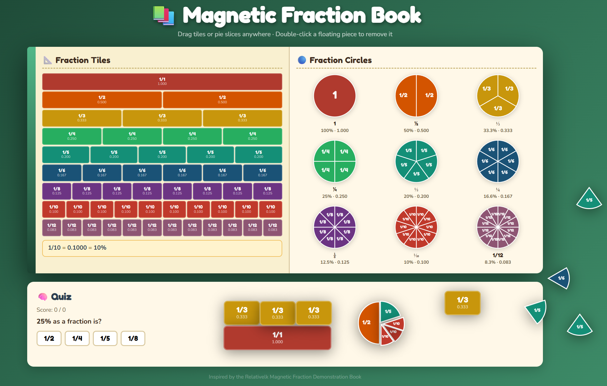

# 📚 Magnetic Fraction Book

An interactive web app inspired by the [Relativelk Magnetic Fraction Demonstration Book](https://relativelk.com). Drag fraction tiles and pie slices freely anywhere on the page to visually compare and explore fractions.

---

## Features

### Fraction Tiles (left page)
Each row represents one fraction, divided into equal rectangular pieces proportional to their value — a `½` tile is twice as wide as a `¼` tile. Drag any individual piece onto the page.

### Fraction Circles (right page)
Each circle is divided into equal pie wedges. Drag individual slices out to place them freely. The whole `1` disc can be dragged from its label.

### Free placement
Dropped pieces float freely over the entire page using `position:absolute` — they scroll with the content and stay exactly where you leave them. Drag any placed piece to reposition it. The last piece you touched is always rendered on top.

### Remove pieces
Double-click any floating piece to remove it with a fade-out animation.

### Quiz
A multiple-choice quiz at the bottom tests conversion between fractions, decimals, and percentages.

---

## How to use

No build step, no dependencies beyond two Google Fonts. Just open `fraction-book.html` in any modern browser.

```
open fraction-book.html
```

Works on desktop and mobile. Touch drag is fully supported.

---

## Technical notes

| Topic | Approach |
|---|---|
| SVG hit-testing | Each `<path>` / `<circle>` gets `pointer-events="fill"` so only painted pixels respond. The SVG container has no `pointer-events` override (browser default ignores transparent corners). |
| Mobile drag | `touch-action:none` on every draggable element prevents the browser from claiming the touch for scroll before `pointerdown` fires. |
| Drag engine | `startDrag(e, ghostEl, onDropFn)` for source elements; `startMovePiece(e, fp)` for repositioning. Both share the same `pointermove` / `pointerup` / `pointercancel` handlers. |
| Scroll-stable placement | Pieces are `position:absolute` on `body` (which has `position:relative`). All coordinates use `pageX` / `pageY` so positions are document-relative, not viewport-relative. |
| Z-order | Monotonic `topZ` counter. `bringToTop(el)` is called on spawn and on every grab so the last-touched piece is always on top. |
| Tile sizing | Tile width = `max(22, dec × 230)px` — proportional to the fraction's decimal value. |

---

## Browser support

Any browser that supports the [Pointer Events API](https://developer.mozilla.org/en-US/docs/Web/API/Pointer_events) — all modern browsers since 2019.
